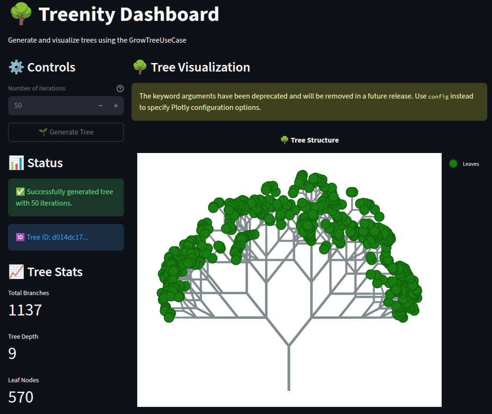

## treenity

A tree generator, hiding the forest.

### Prerequisites

Make sure you have a Python environment (>=3.13) set up.
This project uses Poetry for dependency management.

To set up the project, run:
```bash
make setup
```

### Running the Application

Once the environment is installed, you can run both the backend and frontend:

Backend (FastAPI):
```bash
uvicorn treenity.adapters.primary.fastapi.main:app --reload --port 8000
```

Frontend (Streamlit):
```bash
streamlit run treenity/adapters/primary/streamlit/main.py --server.port 8501
```

The dashboard will be available at `http://localhost:8501`.


